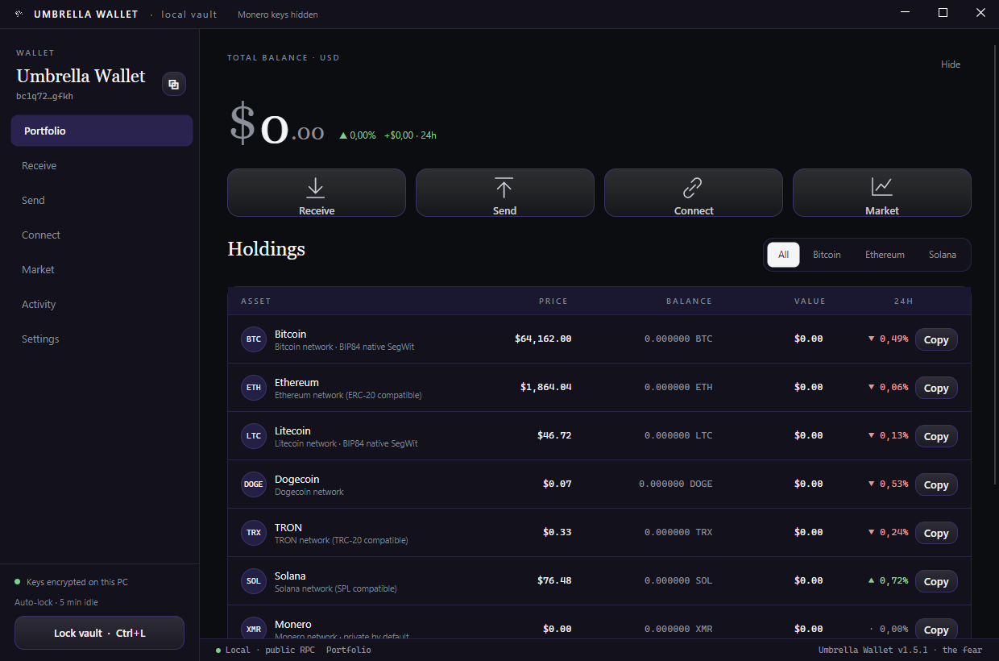
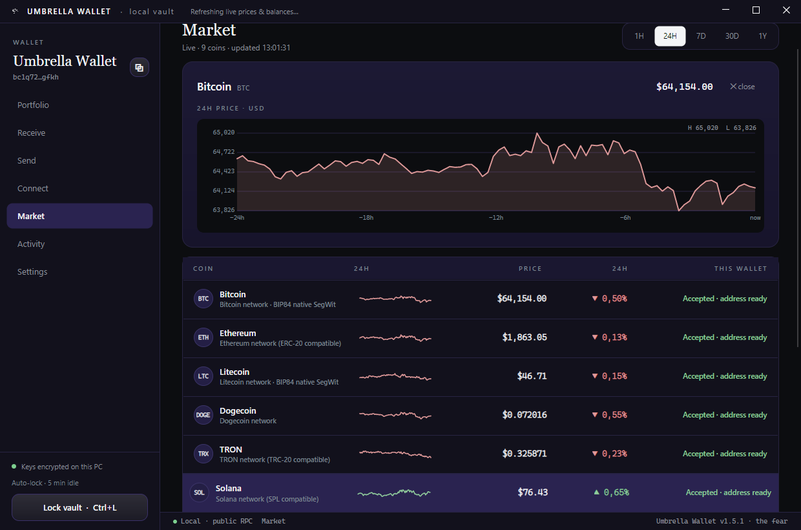

<div align="center">

<picture>
  <source media="(prefers-color-scheme: dark)" srcset="docs/assets/umbrella-logo-solidwhite.png" width="150"/>
  
</picture>

# ☂️ Umbrella Wallet

### Your money. Your keys. Nobody watching. 🌧️

**The crypto wallet that never asks who you are.**
No account. No email. No phone number. No KYC. Just a wallet — the way it was meant to be.

<br/>


<br/>


<br/>

**[⬇️ Download Windows installer (v1.8.0)](https://github.com/kiurakku/umbrella-wallet/releases/latest/download/UmbrellaWallet-Setup-1.8.0.exe)** · [All releases](https://github.com/kiurakku/umbrella-wallet/releases)

<br/>



<sub>a project by  <b>the fear</b> · owner <a href="https://github.com/kiurakku">kiurakku</a> · © 2026</sub>

</div>

---

## 🌂 Why Umbrella?

Every mainstream wallet and exchange wants your passport, your face, your phone — and then keeps your coins on **their** servers. When they freeze, get hacked, or simply decide you're "suspicious", your money stops being yours. 🧊

Umbrella flips that model:

- 🕵️ **Truly anonymous.** Install and go. There is no registration screen, because there is nothing to register. Nothing in the app identifies you.
- 🔑 **You hold the keys.** Your 24-word recovery phrase is created on *your* computer and never leaves it. Not to us, not to anyone. We literally *cannot* touch your funds — that's the point.
- 🧅 **Tor built in.** Flip one switch and the wallet's traffic goes through the Tor network — no separate install, no configuration. Your IP stays out of your finances.
- 🥷 **Secrets that can't be screenshotted.** While your recovery phrase is on screen, the window renders black to screen-capture and remote-viewing software.
- 💸 **Real money movement.** Send and receive Bitcoin, Ethereum, USDT, Monero and more — to any wallet or exchange in the world. Transactions are signed on your machine; only the signed result ever goes out.
- 🎨 **Yours to look at.** Ten colour themes, six interface languages, movable navigation — and a flock of animated Telegram-style duck stickers 🦆 living in the interface. A private wallet doesn't have to feel like a tax form.

## ⚔️ Umbrella vs. the usual suspects

| | ☂️ Umbrella | 🏦 Exchange app | 👛 Typical wallet |
|---|:---:|:---:|:---:|
| Sign-up / KYC | ❌ none | 🪪 passport + selfie | 📧 often email |
| Who holds the keys | 🫵 you | 🏢 them | 🫵 you |
| Can freeze your funds | ❌ impossible | ✅ any time | ❌ |
| Tor anonymity | ✅ one switch | ❌ | ⚠️ manual setup |
| Monero support | ✅ full wallet | ⚠️ delisting it | ❌ rare |
| Screenshot-proof seed | ✅ | — | ❌ |
| Tracks you | ❌ zero analytics | ✅ extensively | ⚠️ usually |
| Price | 🆓 | "free" (you're the product) | 🆓 |

## 💼 What you can do

| | |
|---|---|
| 📥 **Receive** | One tap shows a QR + address for any coin. Colour-coded so you never receive on the wrong network. |
| 📤 **Send** | To any address or exchange deposit. Clear review step, economical fees by default. |
| 👁️ **Watch** | Track any public address (your Ledger, an old MetaMask) without ever importing a key. |
| 🏦 **Link exchanges** | See your Binance, Bybit, OKX, Kraken, KuCoin, Gate.io, MEXC, Bitget and Telegram CryptoBot balances beside your on-chain coins — via **read-only** keys that can't move funds. |
| 📊 **Follow the market** | Real candles, five time windows (1H → 1Y), auto-refresh — for every listed coin. |
| 💾 **Back up** | One click exports an encrypted backup file. Useless to a thief, priceless to future-you. |
| 🔐 **Lock** | Auto-locks after idle. `Ctrl+L` locks instantly. |

<div align="center">

<br/><sub>📈 Live market · exchange-style charts · 1H to 1Y</sub>
</div>

## 🪙 Coins

| Coin | Receive | Send | Notes |
|------|:-------:|:----:|-------|
| 🟠 Bitcoin (BTC) | ✅ | ✅ | native SegWit |
| 🔷 Ethereum (ETH) | ✅ | ✅ | ERC-20 compatible address |
| 💵 **USDT (TRC-20)** | ✅ | ✅ | Tether on TRON — fee paid in TRX |
| 🕶️ **Monero (XMR)** | ✅ | ✅ | full private wallet, powered by Monero's own engine |
| ⚪ Litecoin (LTC) | ✅ | ✅ | native SegWit |
| 🟣 Solana (SOL) | ✅ | ✅ | |
| 🔺 TRON (TRX) | ✅ | ✅ | |
| 🐕 Dogecoin (DOGE) | ✅ | ➖ | receive + balance |
| 💎 TON · 🔵 Cardano | 🚧 | 🚧 | coming — held back until address generation is verified to the letter, because a wrong address loses coins |

## 🎨 Make it yours

- **10 themes** — Purple *(the fear)* · Blue · Green · Black OLED · White light · Violet gradient · Sunset gradient · Crimson · Amber · Slate. Switch live, no restart.
- **6 languages** — 🇬🇧 English · 🇺🇦 Українська · Русский · 🇨🇳 中文 · 🇪🇸 Español · 🇩🇪 Deutsch.
- **Movable navigation** — park the menu left, right, top or bottom.
- **Duck stickers** 🦆 — animated Telegram stickers greet you on Welcome, Receive, Send, Connect, Activity and Settings. Serious cryptography, unserious ducks.

## 📦 Download

| Platform | Package | Notes |
|----------|---------|-------|
| **Windows** | [`UmbrellaWallet-Setup-1.8.0.exe`](https://github.com/kiurakku/umbrella-wallet/releases/latest/download/UmbrellaWallet-Setup-1.8.0.exe) | Installer — choose your folder |
| **Windows** | portable `.exe` from [Releases](https://github.com/kiurakku/umbrella-wallet/releases) | No install required |
| **Linux** | `tar.gz` from [Releases](https://github.com/kiurakku/umbrella-wallet/releases) | `./Umbrella.Wallet.App` |

## 🚀 Get started

1. ⬇️ **Windows** — download `UmbrellaWallet-Setup.exe` (installer, choose your folder) or the portable exe.
2. 🐧 **Linux** — grab the tar.gz build, unpack, run `./Umbrella.Wallet.App`.
3. 🌐 **Web** — the browser version keeps your phrase in the browser; the server only ever sees *public* data.
4. 🖊️ Create a wallet → **write the 24 words on paper** → done. You now have a bank in your pocket that answers to no one.

> ✍️ **The 24 words ARE the wallet.** Anyone who has them has your money; if you lose them and your device, nobody in the universe can bring your coins back — including us. That is what "your keys" costs, and what it's worth.

## ❓ FAQ

<details><summary><b>💰 Is it really free?</b></summary><br/>
Yes. Download, use, send, receive — free. The license reserves the right to add a small, clearly-disclosed service fee to certain in-app transactions in the future; if that ever happens, you'll see it on the review screen before you confirm anything.
</details>

<details><summary><b>🔍 Can you see my balance or transactions?</b></summary><br/>
No. There is no server of ours holding your data. The app reads public blockchains directly (through Tor if you enable it), and your keys never leave your device. We can't see you, and we like it that way.
</details>

<details><summary><b>😱 I forgot my password / lost my phrase. Can you help?</b></summary><br/>
With the 24 words — yes, you can restore everything on any device, yourself. Without them — nobody can, and that includes us. That's not a policy, it's mathematics.
</details>

<details><summary><b>🏦 Can I move coins from Binance / another wallet here?</b></summary><br/>
Yes. Open <i>Receive</i>, pick the coin, and withdraw from the exchange to the shown address — mind the network (e.g. USDT must come over TRON/TRC-20). Or import an existing wallet's 12/24-word phrase directly.
</details>

<details><summary><b>🕶️ Why is Monero special here?</b></summary><br/>
Most wallets show XMR at best as "receive only". Umbrella ships Monero's own wallet engine inside the app, so XMR is a full coin: real balance, real private sending, keys never leaving your machine.
</details>

<details><summary><b>🧅 Do I need to install Tor?</b></summary><br/>
No — it's inside the app. One switch in <i>Settings → Privacy & Tor</i>, and the wallet's traffic goes through the Tor network on a private port that won't clash with a Tor Browser you already run.
</details>

## 🗺️ Roadmap

- 💎 **TON** and 🔵 **Cardano** — full receive/send, gated on letter-perfect address verification
- 🐕 Dogecoin sending
- 📱 More platforms
- 🔔 Price alerts
- 🌐 More exchange integrations on request

## 🛠️ For builders

<details>
<summary>Build from source (click to expand)</summary>

**Desktop** (.NET 8 + Avalonia):

```bash
cd desktop
dotnet run --project src/Umbrella.Wallet.App/Umbrella.Wallet.App.csproj   # run
dotnet test                                                               # 77 tests, crypto pinned to published vectors
```

Windows release: `./scripts/fetch-tor.ps1`, `./scripts/fetch-monero.ps1`, then `dotnet publish -r win-x64`.
Linux release: `./scripts/publish-linux.sh` (fetches Linux Tor/Monero helpers, packs a tar.gz).

**Web** (React + NestJS):

```bash
npm install && npm run dev                        # frontend
cd backend && npm install && npm run start:dev    # backend
```

Specs: [`UMBRA_BACKEND_SPEC.md`](./UMBRA_BACKEND_SPEC.md) · [`UMBRA_AGGREGATOR_ADDENDUM.md`](./UMBRA_AGGREGATOR_ADDENDUM.md) · [`DEPLOY.md`](./DEPLOY.md)

**Security internals:** 256-bit seed from the OS CSPRNG → BIP39 · vault encrypted with Argon2id (64 MiB) + AES-256-GCM · Monero keys go only to the local audited `monero-wallet-rpc` · Tor Expert Bundle on a private SOCKS port · backups exported still-encrypted.

</details>

## 📖 Documentation

The complete, self-contained project documentation lives in **[`docs/`](docs/README.md)** — written
so a newcomer, a new engineer, or an AI assistant can understand the whole thing without hunting
through code:

| | |
|---|---|
| [Overview](docs/01-overview.md) · [Architecture](docs/02-architecture.md) · [Tech stack](docs/03-tech-stack.md) | what it is, how it fits together, what it's built with |
| [Desktop](docs/04-desktop.md) · [Web routes](docs/05-web-routes.md) · [Backend](docs/06-backend.md) | each product in depth |
| [💸 Financial part](docs/07-financial.md) | **fees, sending mechanics, why TRC-20 costs what it does, the disclosed developer fee** |
| [Security](docs/08-security.md) · [Build & deploy](docs/09-build-deploy.md) · [Extending](docs/10-extending.md) · [Glossary](docs/11-glossary.md) | threat model, commands, recipes, terms |

## ⚠️ The honest part

Umbrella is **non-custodial**. That word means: *we never hold your money, so we can never lose it, freeze it — or recover it.* You are the bank now. 🏦 Guard your phrase, check addresses before sending, start with a small test amount. Crypto transactions are final; there is no undo button anywhere in the world. The software is provided as-is, without warranty — see [LICENSE](LICENSE). Nothing here is financial advice.

## ℹ️ About

**Umbrella Wallet** is a privacy-first, non-custodial cryptocurrency wallet for desktop (primary) with an optional web companion. Built and owned by **[kiurakku](https://github.com/kiurakku)**.

| | |
|---|---|
| **Repository** | https://github.com/kiurakku/umbrella-wallet |
| **Releases** | https://github.com/kiurakku/umbrella-wallet/releases |
| **Issues** | https://github.com/kiurakku/umbrella-wallet/issues |
| **License** | [LICENSE](LICENSE) — free to use, no derivatives |
| **Owner** | [kiurakku](https://github.com/kiurakku) |

**Topics:** `#umbrella-wallet` `#crypto-wallet` `#bitcoin` `#ethereum` `#monero` `#tor` `#privacy` `#self-custody` `#non-custodial` `#avalonia` `#dotnet` `#desktop-wallet` `#defi` `#web3` `#kiurakku`

## 💬 Support

Made and maintained by **[kiurakku](https://github.com/kiurakku)**. Questions and bug reports are welcome as issues in this repository — answered with care, on a best-effort basis, without creating any legal obligation. 🤝

## 📄 License

**Free to use. Not free to take.** ☂️ Umbrella is the property of **kiurakku**; anyone may download and use it at no charge, but copying, modifying or republishing it is not permitted. The author carries no legal or financial liability for how it is used — full terms in [LICENSE](LICENSE).

---

<div align="center">

<br/>
<sub><b>the fear</b> · privacy · self-custody · no middlemen<br/>☂️ © 2026 <a href="https://github.com/kiurakku">kiurakku</a> · all rights reserved</sub>
</div>


