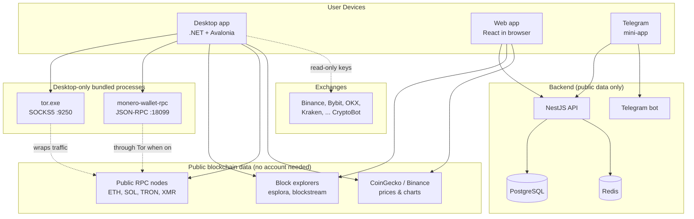
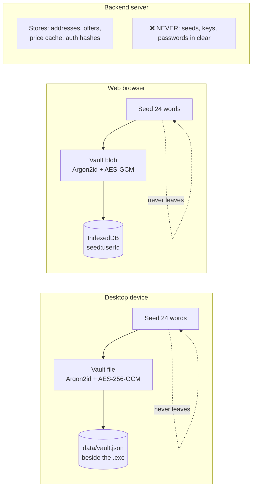
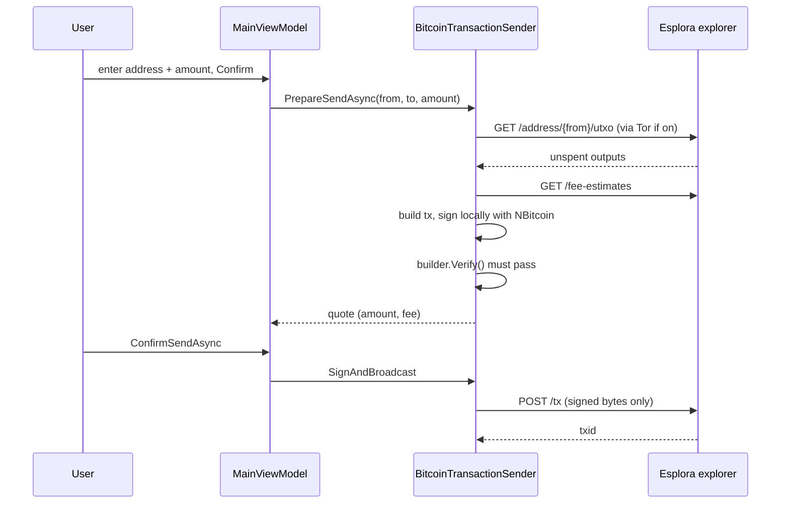
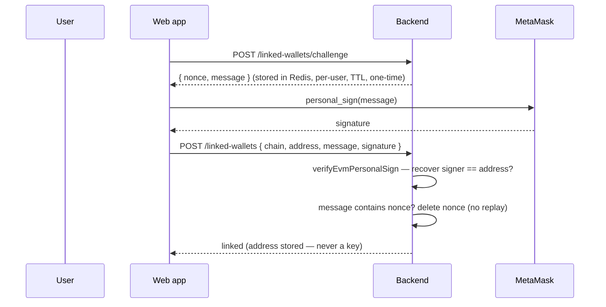

# 2 · Architecture

## The big picture



**Key reading:** the desktop talks *directly* to public blockchain data (optionally wrapped in Tor)
and never needs the backend. The web app uses the backend only for the *aggregator* half (auth, P2P,
linked-account list) — its wallet half also talks to public data directly from the browser.

## Where private keys live

This is the most important diagram in the whole project.



The seed exists in exactly two places, both on the user's own machine: the desktop vault file, or
the browser's IndexedDB. **No arrow crosses into the server.** The backend's user table stores an
Argon2id *hash* of the login password (not the encryption password, and never the seed).

## Repository layout

```
Umbrella Wallet/
├── desktop/                         # Product 1 — .NET/Avalonia wallet
│   ├── src/
│   │   ├── Umbrella.Wallet.Core/            # pure crypto: BIP39, derivation, Monero keys
│   │   ├── Umbrella.Wallet.Infrastructure/  # network: senders, Tor, Monero RPC, vault I/O
│   │   └── Umbrella.Wallet.App/             # UI: Avalonia views + view-models
│   ├── tests/                               # 77 tests, pinned to published test vectors
│   ├── scripts/                             # fetch-tor.ps1, fetch-monero.ps1, publish-linux.sh
│   └── installer/umbrella.iss               # Inno Setup Windows installer
│
├── src/                             # Product 2 — web frontend (React)
│   ├── routes/                              # pages: index, exchange, p2p, stats, settings, legal
│   ├── components/                          # UI + wallet sheets
│   ├── lib/
│   │   ├── wallet/                          # seedManager, vault, walletCore, monero, tor, coinjoin
│   │   ├── api/                             # REST client + demo-mode implementation
│   │   └── market/                          # price/chart helpers
│   └── content/legal/                       # terms, privacy, agreement, rules
│
├── backend/                        # Product 3 — NestJS API
│   ├── src/
│   │   ├── auth/                            # JWT access+refresh, register/login
│   │   ├── users/  linked-wallets/  linked-bank-accounts/
│   │   ├── p2p/                             # offers, orders, state machine
│   │   ├── rates/                           # price aggregation + conversion
│   │   ├── kyc/    webhooks/                # optional KYC + signed webhooks
│   │   ├── telegram/                        # bot + mini-app auth
│   │   └── common/                          # crypto, env, throttler, webhook util
│   └── prisma/schema.prisma                 # database schema
│
├── docs/                           # ← you are here
└── README.md  LICENSE  DEPLOY.md
```

## Data-flow examples

### Desktop: "send 0.01 BTC"



The private key is used only inside `BitcoinTransactionSender` on the device; only the finished
signed transaction leaves.

### Web: "link my MetaMask address"



Only a signature and a public address are involved. The backend proves the user controls the address
without ever seeing its key.

## Why the two "wallet" halves are separate code

The desktop and web wallets implement the **same cryptography** (BIP39, Argon2id, AES-GCM) but in
**different languages** (C# vs TypeScript) because they run in different environments. They are kept
deliberately in sync at the spec level — same word count, same KDF parameters, same derivation paths
— so a seed created in one can be imported into the other. They are not a shared library; each is
tested independently against the published BIP/SLIP test vectors.
